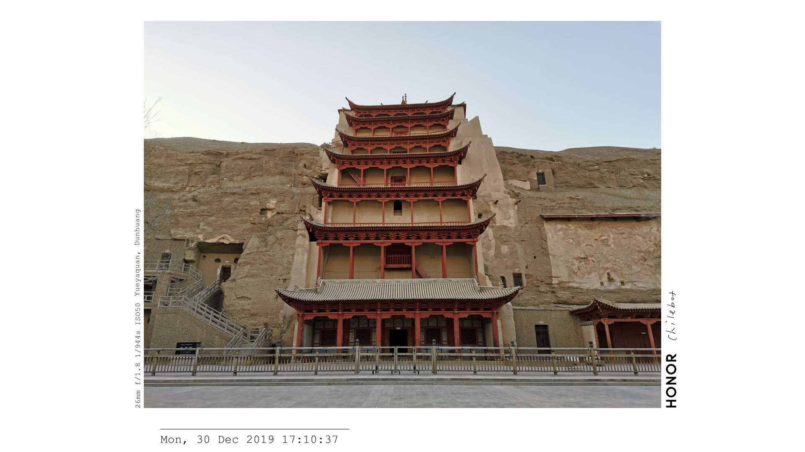
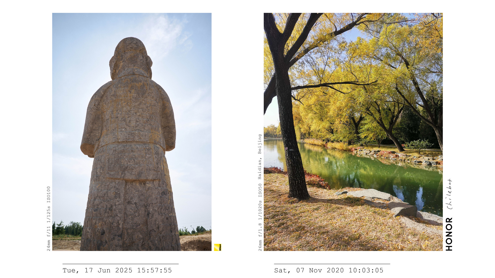
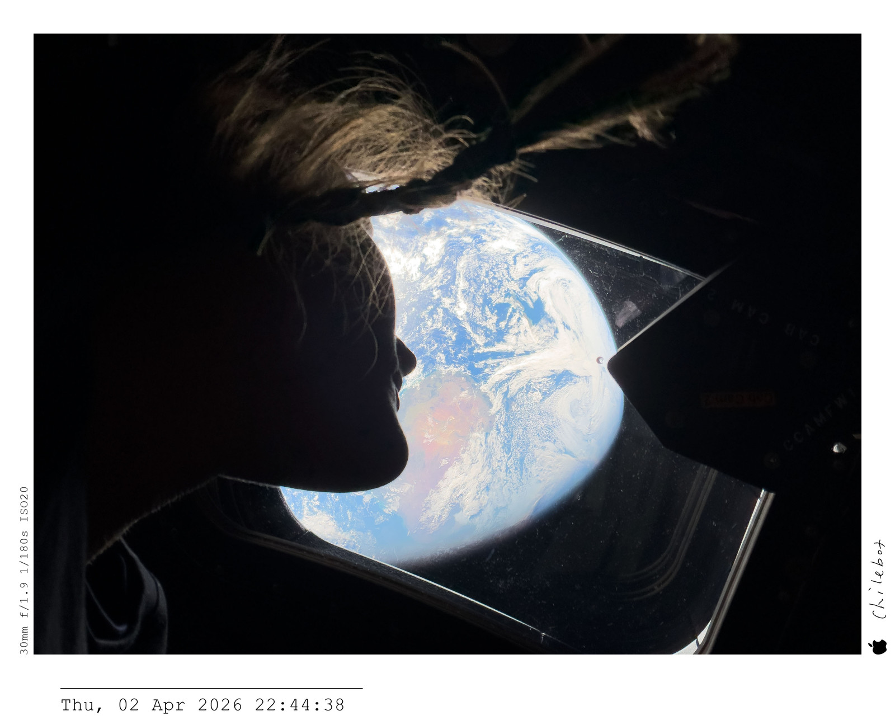
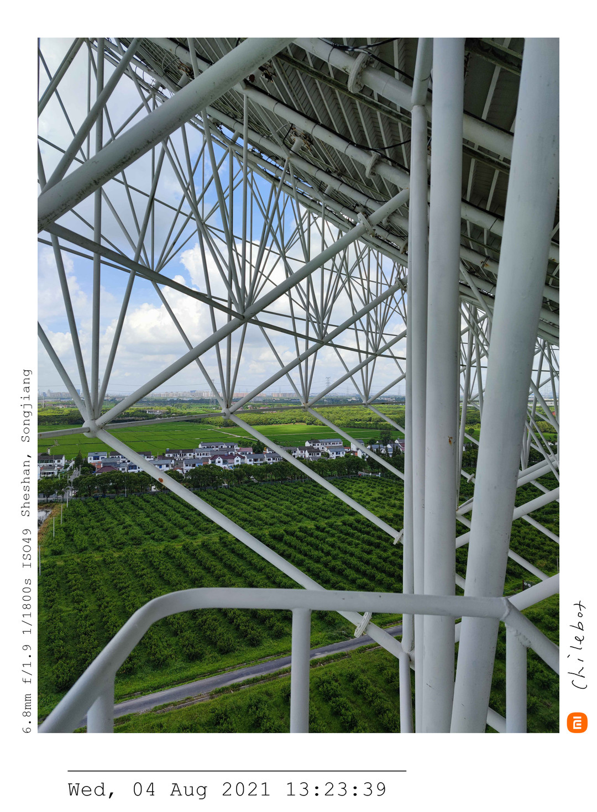

# Watermark Tool

为照片添加边框、拍摄参数、日期、品牌 Logo 和个人签名，支持单张处理、批量导出和多图拼接。可通过命令行使用，也可配置 macOS Finder 右键快速操作。

[下载最新版本](https://github.com/chilemay-0417/watermark-tool/releases/latest) · [使用指南](docs/usage.md) · [签名与品牌定制](docs/customization.md) · [更新日志](CHANGELOG.md)

## 功能与效果

- 自动读取拍摄参数、日期和相机品牌，添加边框、Logo 与个人签名。
- 支持单张处理、逐张批量导出和多图合成，提供三种布局模式。
- 支持 JPEG、PNG、WebP、HEIC / HEIF 输入，导出 JPEG 或 PNG；支持来源色域、16 位 PNG 及可选的元数据保留。

### video：为照片制作视频

生成 **3840 × 2160（16:9）** 图片，供剪辑软件制作视频。支持 1～3 张照片，左右留白与照片间距相等；水印空间不足时，自动降低照片高度。

**单张照片**

<a href="samples/phone1_watermark.jpg"></a>

**两张竖向照片合成**

<a href="samples/vertical1_vertical2_watermark.jpg"></a>

**多张照片：自动降低高度，避免 Logo 与参数重叠**

<a href="samples/phone2_vertical1_vertical2_watermark.jpg"></a>

### adaptive：让边框贴合照片

画布宽度随照片调整，适合单图分享和多图长拼接。横向、竖向照片可以混排，程序不限制拼接张数或宽度，实际导出受内存和图片格式限制。

**单张横向照片**

<a href="samples/horizontal1_watermark.jpg"></a>

**单张竖向照片**

<a href="samples/phone2_watermark.jpg"></a>

**多张照片自由拼接**

<a href="samples/horizontal1_phone1_phone2_vertical1_vertical2_watermark.jpg"></a>

以上图片及 `samples/` 中的照片均已压缩，仅供效果展示，点击可查看展示大图。默认模式为 `video`，以 JPEG 100% 质量、4:4:4 色度采样导出。

### original：保留照片原始尺寸

保留每张照片旋正后的原始像素尺寸，顶部对齐，画布随照片和水印扩展。使用 `--output-mode original -o output.png` 可避免照片缩放和 JPEG 重编码；适合保留细节，输出体积也更大。

## 安装与使用

需要 **Python 3.10+**。从上方链接下载并解压项目，保留完整文件夹。在终端中运行（将路径替换为实际项目目录，路径含空格时保留引号）：

```bash
cd "/path/to/watermark_tool"
python3 -m venv .venv
source .venv/bin/activate
python -m pip install -r requirements.txt
```

安装完成后，在同一终端中为单张照片加水印；重新打开终端时，先进入项目目录并执行 `source .venv/bin/activate`：

```bash
python3 layout.py samples/horizontal1.jpg
```

将多张照片合成一张图片，用 `--output-mode` 选择模式：

```bash
python3 layout.py samples/vertical1.jpg samples/vertical2.jpg --output-mode video
```

默认在第一张照片的目录保存 `原文件名_watermark.jpg`，合成时会连接各照片文件名；重名时自动追加序号。可用 `-o output.png` 指定输出路径及格式。

逐张批量导出：

```bash
python3 layout.py --batch photo1.jpg photo2.jpg --output-mode adaptive
```

不加 `--batch` 时，多张输入会合成一张；`--batch` 不能与 `-o` 同用。

**macOS 右键使用**：按 [Finder 配置步骤](docs/usage.md#在-finder-中右键使用) 添加「照片加水印」和「合成水印照片」两个快速操作，即可在 Finder 中选中照片后右键运行。

**调整默认设置**：修改 [config.py](src/watermark_tool/config.py) 中的 `OUTPUT_MODE` 等配置；更多命令与参数见 [使用指南](docs/usage.md)。

## 使用须知

- 焦距优先显示 **35mm 等效焦距**，缺失时显示实际焦距；日期仅显示 EXIF 拍摄时间，精确到秒，不显示小数秒和时区；拍摄时间缺失或无效时不显示日期。
- GPS 地点查询默认开启，有坐标时会发送经纬度给 Nominatim 查询地名。可用 `--include-gps-location false` 关闭；`--preserve-gps true` 单独控制单图成片中的 GPS 字段，GPS 字段保留默认关闭。
- 仅处理 SDR 图片，不支持 RAW 和 TIFF；请先在照片编辑软件中转换为 SDR PNG 或 JPEG。默认保留来源 RGB 色域，混合 SDR 色域使用 ProPhoto RGB；广色域成片需用支持 ICC 的软件查看，分享可选 `--color-mode srgb`。
- 默认保留筛选后的拍摄参数、作者、版权和单图 DPI，重建尺寸及方向，移除旧缩略图、MakerNote、设备序列号；可用 `--metadata none` 删除非色彩元数据。详细策略见 [使用指南](docs/usage.md#色彩与元数据)。
- JPEG 100% 仍为有损编码；PNG 无损编码不代表缩放或色彩转换没有损失。大尺寸、多图合成会占用较多内存。

## 支持与反馈

安装、Finder 配置及常见问题见 [使用指南](docs/usage.md)，更换签名和 Logo 见 [定制说明](docs/customization.md)。遇到问题可提交 [GitHub Issue](https://github.com/chilemay-0417/watermark-tool/issues)，附上系统、Python 版本、运行命令或操作步骤，以及完整报错。

## 许可

代码采用 [MIT License](LICENSE)。照片样张、个人签名和第三方品牌 Logo 的授权需分别确认。
