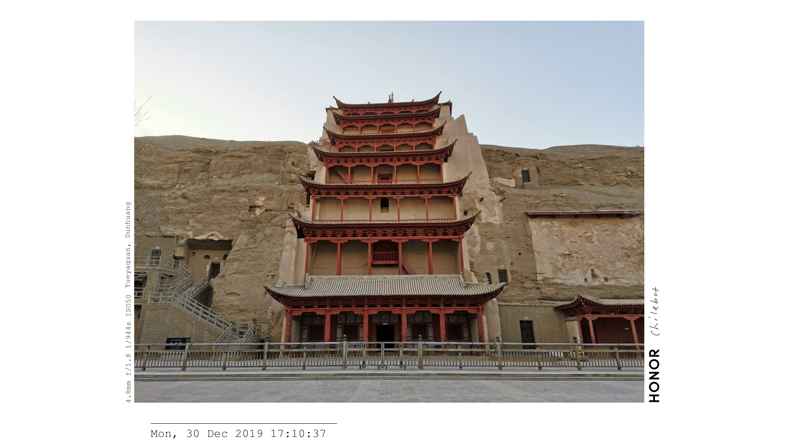
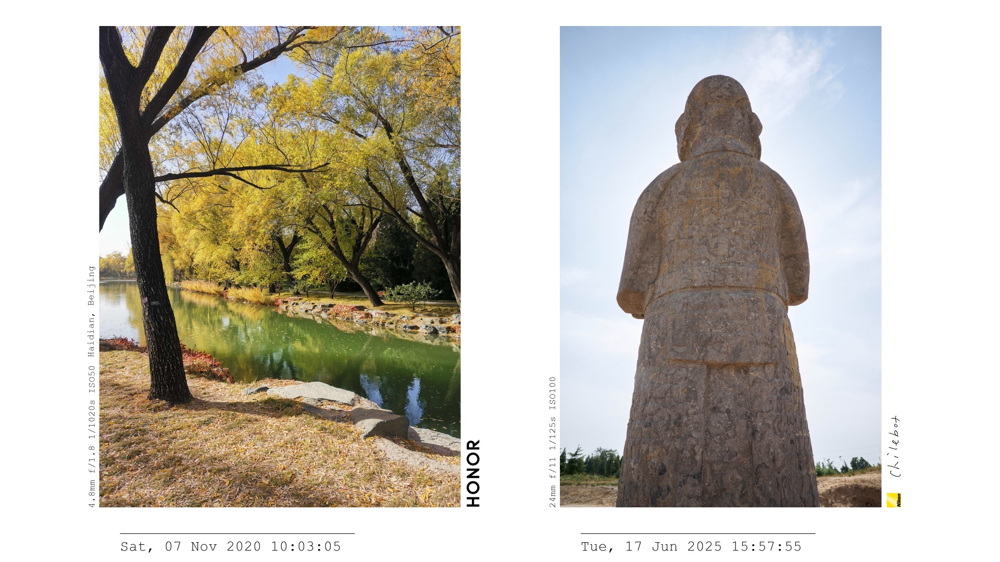
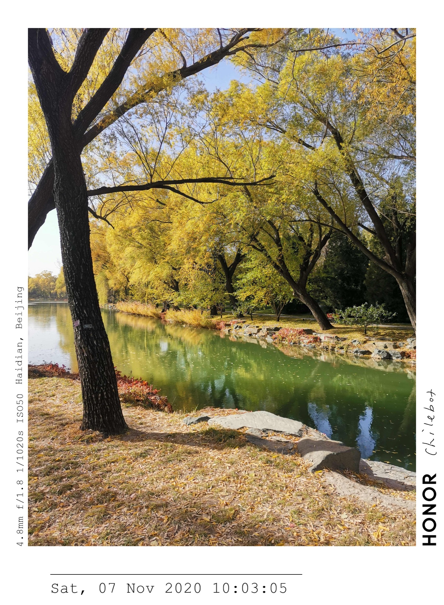

# Watermark Tool

一个为照片添加水印和边框的工具。可以处理单张照片，也可以一次选择多张照片，批量导出每张照片的水印图片；还支持将 1～3 张照片合成为一张排版图。

水印可包含拍摄日期、焦距、光圈、快门、ISO、拍摄地点、相机品牌 Logo 和个人签名。在 macOS 中配置 Finder 快速操作后，选中照片，右键即可运行。

当前版本：**1.0.0**。

## 两种输出模式

### video：为照片制作视频

如果想把照片制作成视频，可以选择 `video` 模式。生成的水印图片统一为 **3840 × 2160（16:9）**，方便导入剪辑软件制作视频相册。照片按原比例缩放，在固定画布中排版。

单张照片：



两张竖向照片合成：



### adaptive：让边框贴合照片

如果希望边框更紧凑、贴合照片，可以选择 `adaptive` 模式。它根据照片内容调整画布宽度，在保留日期、参数和签名区域的同时，减少左右留白，适合直接分享照片。

横向照片：


竖向照片：



两种模式都支持单张导出和多图合成。当前默认使用 `adaptive`，切换方式见下方使用说明。

## 安装

需要 **Python 3.10 或更新版本**；Finder 右键快速操作需要 macOS。

下载项目并解压，或克隆仓库后，在终端进入项目目录，直接安装依赖：

```bash
cd /path/to/watermark_tool
python3 -m pip install -r requirements.txt
chmod +x watermark_batch_each.sh watermark_combine_selected.sh
```

将 `/path/to/watermark_tool` 替换为项目实际路径。首次运行可以用自带样张验证，下面的命令关闭 GPS 联网查询：

```bash
python3 layout.py samples/horizontal1.jpg --include-gps-location false
```

默认在原图所在目录生成 `horizontal1_watermark.jpg`。如果该名称已经存在，会追加 `_2`、`_3` 等序号。需要使用项目记录的依赖版本时，将安装命令中的 `requirements.txt` 换成 `requirements.lock`。

## 在 Finder 中右键使用

打开 macOS「自动操作」（Automator），新建「快速操作」，添加「运行 Shell 脚本」，设置如下：

| 设置项 | 选择 |
| --- | --- |
| 工作流程收到当前 | 图像文件 |
| 位于 | 访达（Finder） |
| Shell | `/bin/zsh` |
| 传递输入 | 作为自变量 |

**单张 / 批量加水印**：在脚本框内粘贴以下内容，保存为「照片加水印」。选择一张或多张照片时，每张照片都会单独导出。

```bash
"/path/to/watermark_tool/watermark_batch_each.sh" "$@"
```

**多图合成**：另建一个快速操作，粘贴以下内容，保存为「合成水印照片」。每次选择 1～3 张照片，合成为一张图片。

```bash
"/path/to/watermark_tool/watermark_combine_selected.sh" "$@"
```

将两个脚本路径替换为项目实际路径。保存后，在 Finder 中选中照片，右键 →「快速操作」→ 选择对应操作。

脚本会自动寻找已安装所需依赖的 Python。如需指定 Python，可在脚本调用前添加 `export WATERMARK_PYTHON_BIN="/path/to/python3"`，填入安装依赖时使用的 Python 路径。

右键操作使用 [config.py](src/watermark_tool/config.py) 中的默认设置。要切换模式，修改其中的 `OUTPUT_MODE = "adaptive"` 或 `OUTPUT_MODE = "video"`；要关闭地点联网查询，将 `INCLUDE_GPS_LOCATION` 改为 `False`。两个 Shell 脚本接收照片路径，临时调整其他参数请使用下方命令行入口。

## 适配相机与图片格式

工具根据照片 EXIF 中的厂商和型号信息自动匹配品牌 Logo，并读取拍摄参数。当前附带 Logo 和匹配规则的品牌有：

| 相机品牌 | 手机品牌 |
| --- | --- |
| Canon、Nikon、Sony、Fujifilm | Apple、Honor、Samsung、OnePlus |
| Leica、Hasselblad、Ricoh、Panasonic Lumix | OPPO、vivo、Xiaomi |
| Olympus / OM System（使用 Olympus 标志） | |

品牌匹配不代表所有机型都经过验证。没有 EXIF、未匹配到品牌或缺少 Logo 文件时，会跳过品牌标志，仍可按设置显示签名。

支持 JPEG、PNG、TIFF、WebP；HEIC / HEIF 通过 `pillow-heif` 读取，NEF、ARW、CR2、CR3、RAF、DNG 等 RAW 格式通过 `rawpy` 读取。实际 RAW 兼容性取决于相机型号和解码库，拍摄参数不一定能够完整读取。

品牌规则位于 [assets/brands.json](assets/brands.json)。添加品牌 Logo、更换签名和指定资源目录的方法见 [定制说明](docs/customization.md)。

## 常用命令

以下命令均在项目目录中运行。示例关闭了 GPS 查询；需要显示拍摄地点时，将 `--include-gps-location false` 改为 `true`。

```bash
# 单张照片：边框紧凑贴合照片
python3 layout.py samples/horizontal1.jpg --output-mode adaptive --include-gps-location false

# 单张照片：生成 16:9 视频素材
python3 layout.py samples/phone1.jpg --output-mode video --include-gps-location false

# 两张竖向照片：合成为一张 16:9 图片
python3 layout.py samples/vertical2.jpg samples/vertical1.jpg --output-mode video --include-gps-location false

# 指定输出文件，使用 .png 后缀导出 PNG
python3 layout.py samples/horizontal1.jpg -o output.png --include-gps-location false

# 使用自定义文字替代签名图片
python3 layout.py samples/horizontal1.jpg --show-signature false --signature-text "Shot by You" --include-gps-location false

# 完全隐藏签名图片及替代文字
python3 layout.py samples/horizontal1.jpg --show-signature false --signature-text "" --include-gps-location false
```

批量为多张照片分别导出时，可使用 Finder 的「照片加水印」，或运行：

```bash
./watermark_batch_each.sh samples/horizontal1.jpg samples/vertical2.jpg
```

这条批量命令与 Finder 使用相同默认设置，包括输出模式和 GPS 开关。直接向 `layout.py` 传入多张照片表示**合成一张**，而不是逐张导出。

默认单张输出名为 `原文件名_watermark.jpg`；合成输出名为 `文件名1_文件名2_watermark.jpg`，保存在第一张照片的目录。示例图中的 `_video_`、`_adaptive_` 是为了区分展示模式，默认命名不会自动加入模式名称；可用 `-o` 自行指定。显式指定 `-o` 时，请避免使用原图或需要保留的已有文件路径。

常用调整参数：

| 参数 | 用途 | 当前默认值 |
| --- | --- | --- |
| `--output-mode` | `video` 固定 16:9；`adaptive` 调整画布宽度 | `adaptive` |
| `--height` | 排版中的照片高度，单位为像素 | `1850` |
| `--jpeg-quality` | JPEG 质量，范围 1～100；分享可尝试 95 | `100` |
| `--include-gps-location` | 是否联网查询拍摄地点 | `true` |
| `--show-signature` | 是否显示签名图片 | `true` |
| `--signature-text` | 关闭签名图片后显示的文字，空字符串表示隐藏 | `哈哈哈` |

日期、字体、线条和间距等更多参数可运行 `python3 layout.py --help` 查看。长期使用的默认设置可在 [config.py](src/watermark_tool/config.py) 中修改。

## 使用说明与当前限制

- **地点查询**：默认开启。照片有 GPS 时，经纬度会发送给 Nominatim（OpenStreetMap）查询地名；照片文件本身在本地处理。关闭方式为 `--include-gps-location false`，或修改默认配置。查询失败或超时时，图片仍可继续导出。
- **多图排版**：`video` 模式中，过宽的照片组合可能放不下，可减小 `--height` 或改用 `adaptive`。不同设备照片合成时，品牌 Logo 与相邻文字可能重叠，导出后请检查排版。
- **拍摄信息**：缺失拍摄日期时，当前版本会使用处理时的日期和时间；部分小于一秒的慢快门值会被取整为倒数形式。需要准确记录时，请核对成片文字。
- **色彩与元数据**：当前导出不保留原始 EXIF，也未进行 ICC 色彩管理，广色域照片可能出现色彩差异。RAW 会先转换为 8-bit RGB，再进入排版流程。
- **运行环境**：若 Finder 提示缺少依赖，可在终端运行 `python3 -c "import sys; print(sys.executable)"` 查看 Python 路径，并通过 `WATERMARK_PYTHON_BIN` 指定它。字体默认从系统查找，也可通过 `--font`、`--location-font` 指定。

## 开发与许可

安装开发依赖并运行检查：

```bash
python3 -m pip install -e ".[dev]"
python3 -m unittest discover
python3 -m ruff check .
```

代码使用 [MIT License](LICENSE)。照片样张、个人签名和第三方品牌 Logo 的使用与分发需分别确认其授权。
