# Watermark Tool

**在 Mac 上，右键就能为照片加水印。**

为照片添加边框、拍摄参数、日期、品牌 Logo 和个人签名。支持 macOS Finder 右键快速操作和终端命令，可单张处理、批量导出或多图拼接。

[下载 v2.3.0](https://github.com/chilemay-0417/watermark-tool/archive/refs/tags/v2.3.0.zip) · [安装指南](docs/usage.md#安装与首次使用) · [使用指南](docs/usage.md) · [颜色与签名定制](docs/customization.md) · [更新日志](CHANGELOG.md)

## 特色：macOS 右键快速操作

在 Finder 选中照片，通过右键「快速操作」即可处理，日常使用无需打开终端。

| 功能 | 右键操作 | 效果 |
| --- | --- | --- |
| 单张加水印 | 单选 → **添加水印** | 生成一张成片 |
| 多图拼接 | 多选 → **添加水印** | 合成为一张成片 |
| 批量加水印 | 多选 → **批量添加水印** | 每张照片分别导出 |

- **自动识别**：读取拍摄参数、日期和相机品牌，匹配对应 Logo。
- **自由定制**：更换个人签名、品牌 Logo，调整布局和文字样式；支持自定义背景、文字、横线和签名颜色，详见 [颜色设置](docs/customization.md#背景与水印颜色)。
- **保留原图**：成片保存到原图目录，重名自动编号；合成时使用第一张输入照片的目录。

## 终端命令

完成 [安装](docs/usage.md#安装与首次使用) 并重新打开终端后，也可用一条命令加水印：

```bash
watermark-tool photo.jpg
```

将 `photo.jpg` 换成照片路径，或直接把照片拖入终端。成片保存在原图目录，无需进入工具文件夹。批量处理和 PNG 导出见 [命令行用法](docs/usage.md#命令与参数)，全部参数可用 `watermark-tool --help` 查看。

## 布局与效果

使用 `adaptive` 时，边框贴合照片。以下样张已压缩，仅展示排版效果，点击可查看大图。

### video：4K 视频素材

生成 **3840 × 2160（16:9）** 图片，供剪辑软件制作视频。支持 1～3 张照片，空间不足时自动降低照片高度。

**单张照片**

<a href="samples/phone1_watermark.jpg"></a>

**两张竖向照片合成**

<a href="samples/vertical1_vertical2_watermark.jpg"></a>

**多张照片：自动降低高度，避免 Logo 与参数重叠**

<a href="samples/phone2_vertical1_vertical2_watermark.jpg"></a>

### adaptive：让边框贴合照片

画布宽度随照片调整，适合单图分享和多图长拼接。横竖照片可混排，实际大小受内存和图片格式限制。

**单张横向照片**

<a href="samples/horizontal1_watermark.jpg"></a>

**单张竖向照片**

<a href="samples/phone2_watermark.jpg"></a>

**多张照片自由拼接**

<a href="samples/horizontal1_phone1_phone2_vertical1_vertical2_watermark.jpg"></a>

### original：保留照片原始尺寸

保留旋正后的照片原始像素尺寸，画布随内容扩展。搭配 PNG 导出可避免缩放和 JPEG 重编码，适合保留细节。

### 12 组精选配色

从明亮的瓷白到沉静的石墨，为不同画面搭配背景、文字、横线和签名；默认使用 01「极简瓷白」，Logo 保持原色。
以下采用同一张照片和 video 版式，方便比较，点击样张可查看大图。选用方法见 [配色设置](docs/customization.md#背景与水印颜色)。

<table>
  <tr>
    <td width="33%" align="center" valign="top">
      <a href="samples/colors/01-porcelain.jpg">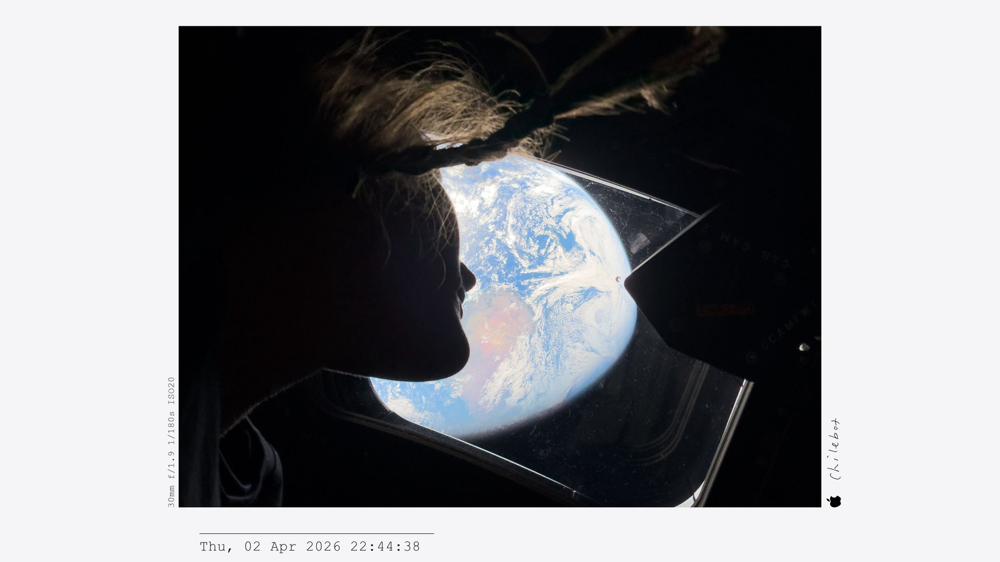</a><br>
      <strong>01 极简瓷白</strong><br>
      适合产品、建筑与极简画面。
    </td>
    <td width="33%" align="center" valign="top">
      <a href="samples/colors/02-natural-titanium.jpg"></a><br>
      <strong>02 原色钛银</strong><br>
      适合街拍、日常与自然光人像。
    </td>
    <td width="33%" align="center" valign="top">
      <a href="samples/colors/03-starlight.jpg">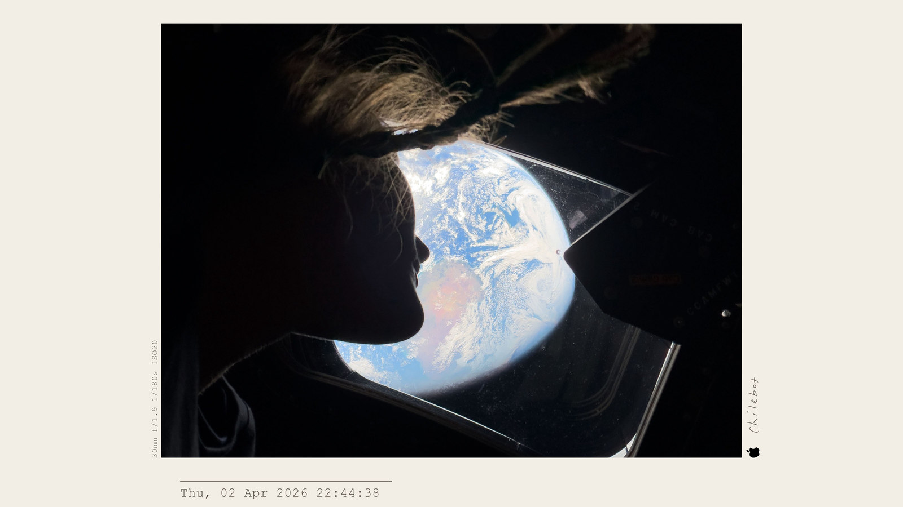</a><br>
      <strong>03 星光米白</strong><br>
      适合暖光人像、室内与生活记录。
    </td>
  </tr>
  <tr>
    <td width="33%" align="center" valign="top">
      <a href="samples/colors/04-sage-mist.jpg">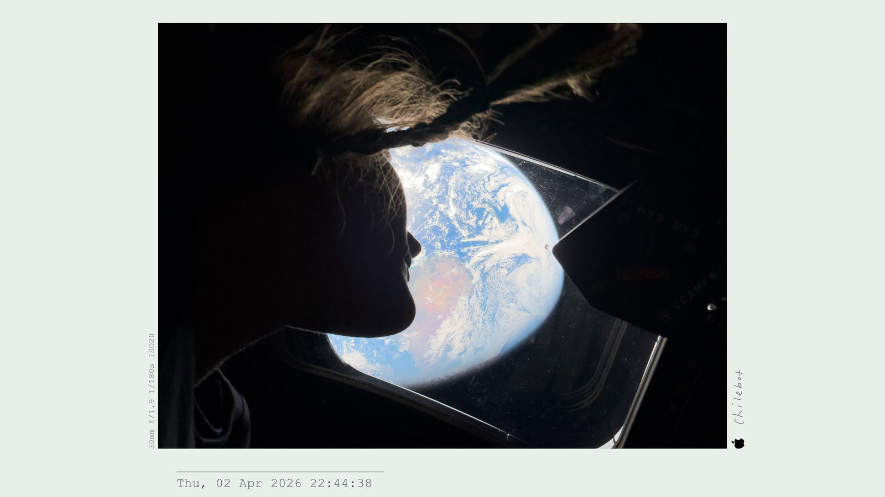</a><br>
      <strong>04 鼠尾草雾</strong><br>
      适合绿植、自然与清新日常。
    </td>
    <td width="33%" align="center" valign="top">
      <a href="samples/colors/05-champagne-sand.jpg">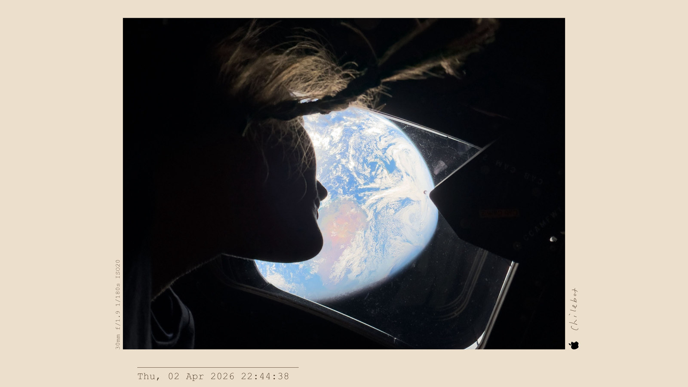</a><br>
      <strong>05 沙丘香槟</strong><br>
      适合旅行、落日与复古画面。
    </td>
    <td width="33%" align="center" valign="top">
      <a href="samples/colors/06-cloud-gray.jpg">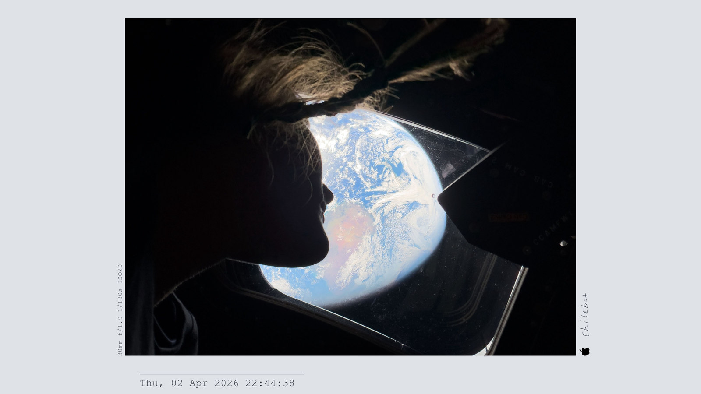</a><br>
      <strong>06 北欧云灰</strong><br>
      适合黑白照片、建筑与冷调街拍。
    </td>
  </tr>
  <tr>
    <td width="33%" align="center" valign="top">
      <a href="samples/colors/07-space-graphite.jpg">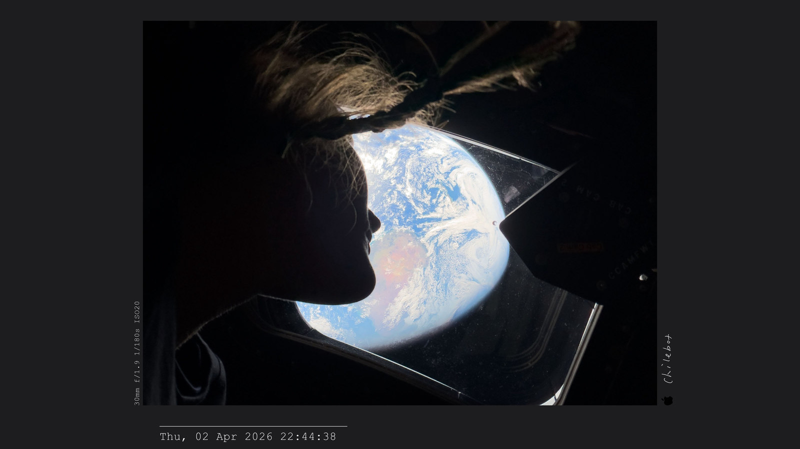</a><br>
      <strong>07 深空石墨</strong><br>
      适合夜景、暗调与强对比画面。
    </td>
    <td width="33%" align="center" valign="top">
      <a href="samples/colors/08-midnight-blue.jpg">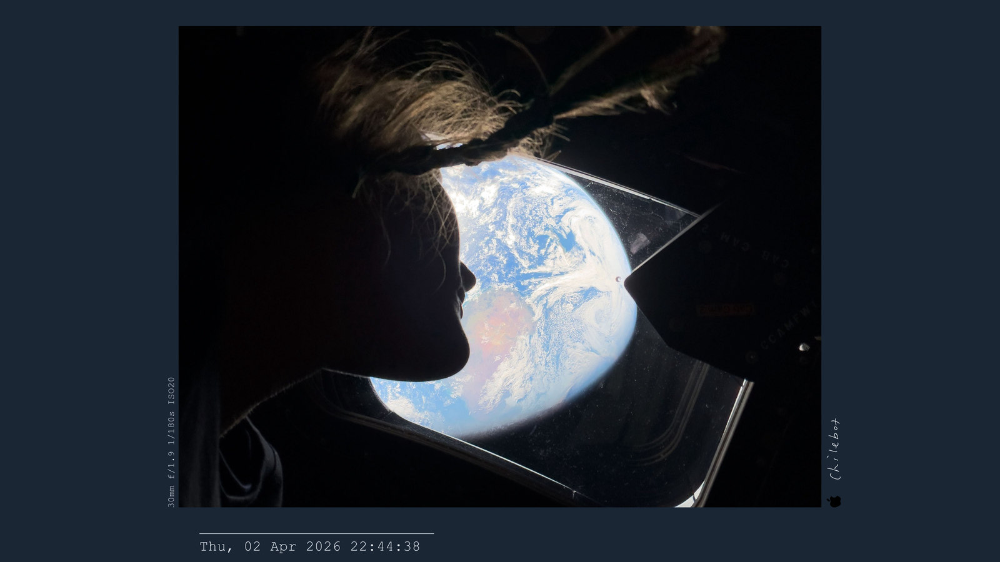</a><br>
      <strong>08 午夜深蓝</strong><br>
      适合夜空、蓝调时刻与城市夜景。
    </td>
    <td width="33%" align="center" valign="top">
      <a href="samples/colors/09-blue-titanium.jpg">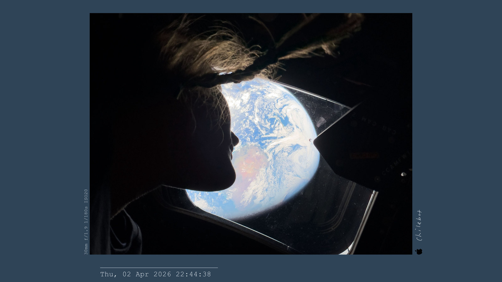</a><br>
      <strong>09 蓝钛暮色</strong><br>
      适合城市、工业与科技感画面。
    </td>
  </tr>
  <tr>
    <td width="33%" align="center" valign="top">
      <a href="samples/colors/10-pine-forest.jpg">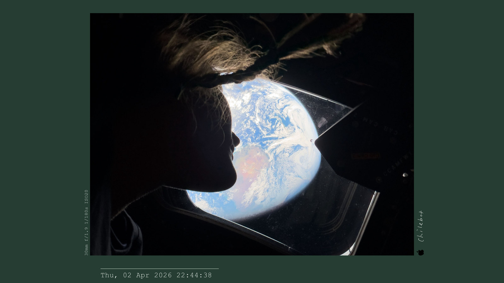</a><br>
      <strong>10 松针森林</strong><br>
      适合山林、户外与胶片色调。
    </td>
    <td width="33%" align="center" valign="top">
      <a href="samples/colors/11-smoky-purple.jpg">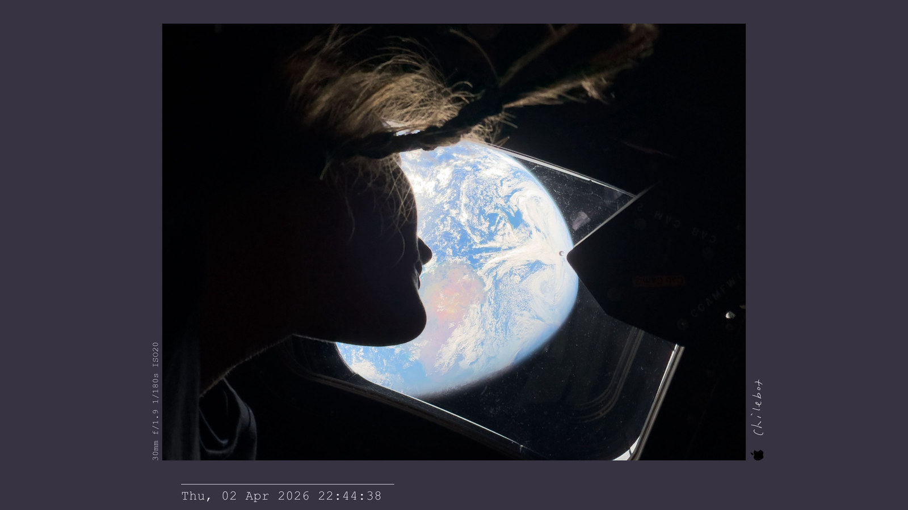</a><br>
      <strong>11 紫夜烟岚</strong><br>
      适合舞台、傍晚与带紫色的光影。
    </td>
    <td width="33%" align="center" valign="top">
      <a href="samples/colors/12-cocoa-wood.jpg">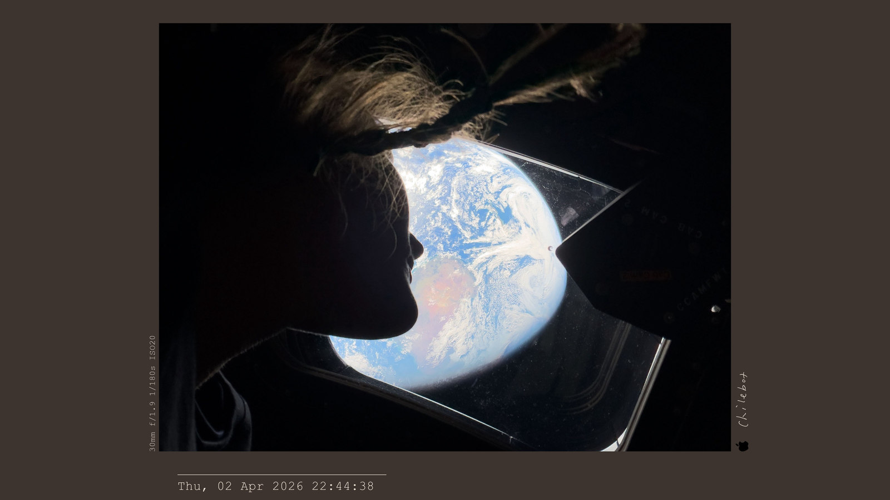</a><br>
      <strong>12 可可乌木</strong><br>
      适合暖调人像、咖啡馆与室内静物。
    </td>
  </tr>
</table>

## 使用须知

- 支持 JPEG、PNG、WebP、HEIC / HEIF，导出 JPEG 或 PNG。RAW、TIFF、HDR 请先转换为 SDR PNG / JPEG。
- JPEG 默认质量为 100%，仍是有损格式；需要保留细节可用原尺寸 PNG。
- 地点查询默认开启，有坐标时会发送给 Nominatim 查询地名，本机缓存 30 天。可在配置中关闭；成片默认不保留 EXIF GPS。

代码采用 [MIT License](LICENSE)。样张、个人签名和品牌 Logo 的授权需分别确认。问题反馈见 [GitHub Issue](https://github.com/chilemay-0417/watermark-tool/issues)，维护者见 [开发说明](docs/development.md)。
